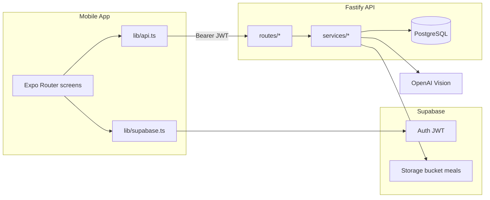

# Architecture

High-level map of how LifePlate fits together. For schema details see `database.md`; for coding patterns see `conventions.md`.

## Monorepo layout

```
lifeplate/
├── apps/mobile/     # Expo app — UI, local caches, Supabase client auth
├── apps/api/        # Fastify server — business logic, OpenAI, Postgres
└── packages/shared/ # Types + pure functions used by both
```

`@lifeplate/shared` must stay free of React, Fastify, and database imports. Build it before API tests (`pnpm --filter @lifeplate/shared build`).

## Runtime diagram



## Authentication

1. Mobile signs in via **Supabase Auth** (`apps/mobile/lib/supabase.ts`).
2. Every API call sends `Authorization: Bearer <access_token>` (`apps/mobile/lib/api.ts`).
3. API validates JWT in `apps/api/src/auth.ts`:
   - Prefers local verification with `SUPABASE_JWT_SECRET` (`services/jwtAuth.ts`)
   - Falls back to Supabase `auth.getUser()` when secret is missing (dev only)
4. On first authenticated request, API **upserts** the user row in Postgres (`db.upsertUser`).

## Meal logging flow (photo)

This is the core path agents touch most often:

1. **Upload** — `POST /api/meals/upload` (`routes/meals.ts`)
   - Multipart image → validate → OpenAI analysis (`services/openai.ts`)
   - Creates a **draft** in `meal_drafts` (not a persisted meal yet)
   - Optional cloud image upload for Plus users (`services/storage.ts`, `userFeatures.ts`)
   - Returns `draftId`, macros, `coachNudge`

2. **Confirm** — `POST /api/meals/confirm`
   - Client sends edited analysis + `draftId`
   - Inserts row in `meals`, deletes draft
   - Side effects: streaks, gamification, optional friend shares (`mealSideEffects.ts`)

3. **Timeline** — `GET /api/meals?from=&to=`
   - Mobile home/timeline reads via `MealsContext` + `lib/mealsCache.ts`

Alternate paths: text log (`POST /api/meals/log-text`), refine draft (`POST /api/meals/refine`), reanalyze on edit (`POST /api/meals/:id/reanalyze`).

## API structure

| Layer | Location | Role |
|-------|----------|------|
| Entry | `apps/api/src/index.ts` | Fastify setup, plugins, route registration |
| Routes | `apps/api/src/routes/*.ts` | HTTP handlers, auth preHandler, request/response |
| Services | `apps/api/src/services/*.ts` | Business logic, OpenAI, storage, rate limits |
| DB | `apps/api/src/db.ts` | `pg` pool, queries, `upsertUser` |
| Config | `apps/api/src/config.ts` | Env vars; production asserts required secrets |

Route modules: `meals`, `insights`, `nutrition`, `users`, `feedback`, `friends`, `gamification`, `mealShares`, `subscription`.

Domain errors with stable `code` fields: `MealGuardrailError`, `RateLimitError`, `FreeTierError` — handled in `index.ts` error handler.

## Mobile structure

| Area | Location | Role |
|------|----------|------|
| Screens | `apps/mobile/app/` | Expo Router file-based routes |
| Components | `apps/mobile/components/` | UI by feature (meal, timeline, insights, …) |
| Context | `apps/mobile/context/` | Global state (auth, meals, friends, gamification, …) |
| API + utils | `apps/mobile/lib/` | `api.ts`, caches, meal upload, RevenueCat, PDF export |
| Theme | `apps/mobile/src/theme/` | Colors and premium styling |

Root layout (`app/_layout.tsx`) wraps providers: Auth → Meals → Friends → Gamification → Nutrition → Hydration, etc.

## Subscriptions (LifePlate Plus)

- Mobile: RevenueCat (`lib/revenueCat.ts`, `PlusPaywallContext`)
- API: webhook + sync (`routes/subscription.ts`, `services/revenueCat.ts`)
- `users.is_paid` gates cloud photo backup and extended log-date window (`packages/shared/freeTier.ts`)

## Deployment

- **API**: Render (`render.yaml`, `.github/workflows/deploy-render.yml`)
- **Mobile**: Expo EAS preview builds on `main` (`.github/workflows/eas-preview.yml`); see `docs/mobile-testing.md`
- **Database**: PostgreSQL (local Docker via `docker-compose.yml`; production via `DATABASE_URL`)
- Migrations: `RUN_MIGRATIONS=true` locally by default; production runs `pnpm db:migrate` separately

## Key files to open first

| Task | Start here |
|------|------------|
| New API endpoint | `apps/api/src/routes/` + matching `services/` |
| New screen | `apps/mobile/app/` + `components/` |
| Shared request/response type | `packages/shared/src/index.ts` |
| Nutrition dashboard logic | `packages/shared/src/nutrition/` |
| Env / config | `.env.example`, `apps/api/src/config.ts`, `apps/mobile/lib/env.ts` |
