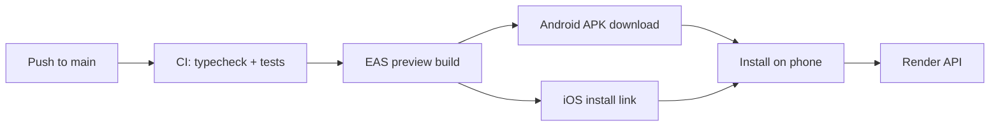

# Mobile testing on device

How to get LifePlate onto your phone after frontend changes land on `main`.

## Overview



1. Push mobile (or shared) changes to `main`.
2. **CI** (`.github/workflows/ci.yml`) runs typecheck and unit tests.
3. **EAS Preview Build** (`.github/workflows/eas-preview.yml`) triggers iOS + Android builds using the `preview` profile in `apps/mobile/eas.json`.
4. Download and install from the [Expo builds dashboard](https://expo.dev) (project slug: `lifeplate`).

The preview app talks to the deployed API. Set `EXPO_PUBLIC_API_URL` to your Render URL (e.g. `https://lifeplate-api.onrender.com`) in the Expo **preview** environment — not in the repo.

## One-time setup

### 1. Expo access token

Create a token at [expo.dev/settings/access-tokens](https://expo.dev/settings/access-tokens) and add it to GitHub:

| Secret | Value |
|--------|-------|
| `EXPO_TOKEN` | Expo access token |

### 2. EAS credentials (run once locally)

From a machine with the Expo CLI installed:

```bash
cd apps/mobile
eas build --profile preview --platform ios
eas build --profile preview --platform android
```

Answer the prompts for Apple Developer and Android keystore. EAS stores credentials for future CI builds.

### 3. Preview environment variables

In [expo.dev](https://expo.dev) → project **lifeplate** → **Environment variables**, add these for the **preview** environment:

| Variable | Example |
|----------|---------|
| `EXPO_PUBLIC_API_URL` | `https://lifeplate-api.onrender.com` |
| `EXPO_PUBLIC_SUPABASE_URL` | your Supabase project URL |
| `EXPO_PUBLIC_SUPABASE_ANON_KEY` | your Supabase anon key |
| `EXPO_PUBLIC_REVENUECAT_ENABLED` | `false` |

Release bundles bake these in at build time (`apps/mobile/lib/env.ts`).

### 4. iOS: register your iPhone

Internal iOS builds use ad-hoc distribution. Register each test device:

```bash
cd apps/mobile
eas device:create
```

Open the link on your iPhone, install the profile, and confirm the device appears in the Expo dashboard. Rebuild after adding new devices.

Add your app redirect URL in Supabase Auth (scheme: `lifeplate://`).

## Installing on your phone

### Android

1. Open the Expo dashboard → **Builds** → latest **preview** Android build.
2. Download the **APK** (the preview profile uses `buildType: "apk"`).
3. Install on the phone (allow installs from unknown sources if prompted).

### iOS

1. Open the Expo dashboard → **Builds** → latest **preview** iOS build.
2. On your **registered** iPhone, open the install link (QR code or URL from the build page).
3. If iOS blocks the app, go to **Settings → General → VPN & Device Management** and trust the developer certificate.

## Manual trigger

To build without pushing to `main`:

**GitHub** → Actions → **EAS Preview Build** → **Run workflow**

Or locally:

```bash
cd apps/mobile
eas build --profile preview --platform all
```

## What CI does and does not cover

| Covered in CI | Not covered — test on device |
|---------------|------------------------------|
| TypeScript (`pnpm typecheck`) | Screen layout and navigation |
| `lib/` unit tests | Camera / photo upload flow |
| Shared type compatibility | Supabase auth on device |
| | iOS home-screen widget |
| | RevenueCat / Plus paywall |

## Local development (Mac + Xcode)

If you have a Mac, you can skip EAS for quick iteration:

```bash
cp .env.example apps/mobile/.env   # point EXPO_PUBLIC_API_URL at Render or local API
pnpm ios:device                    # physical iPhone via USB
```

See `apps/mobile/AGENTS.md` for day-to-day mobile development.
